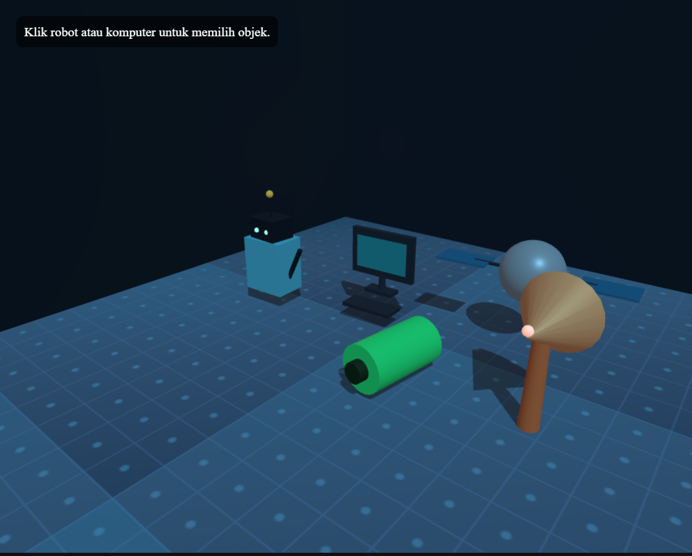
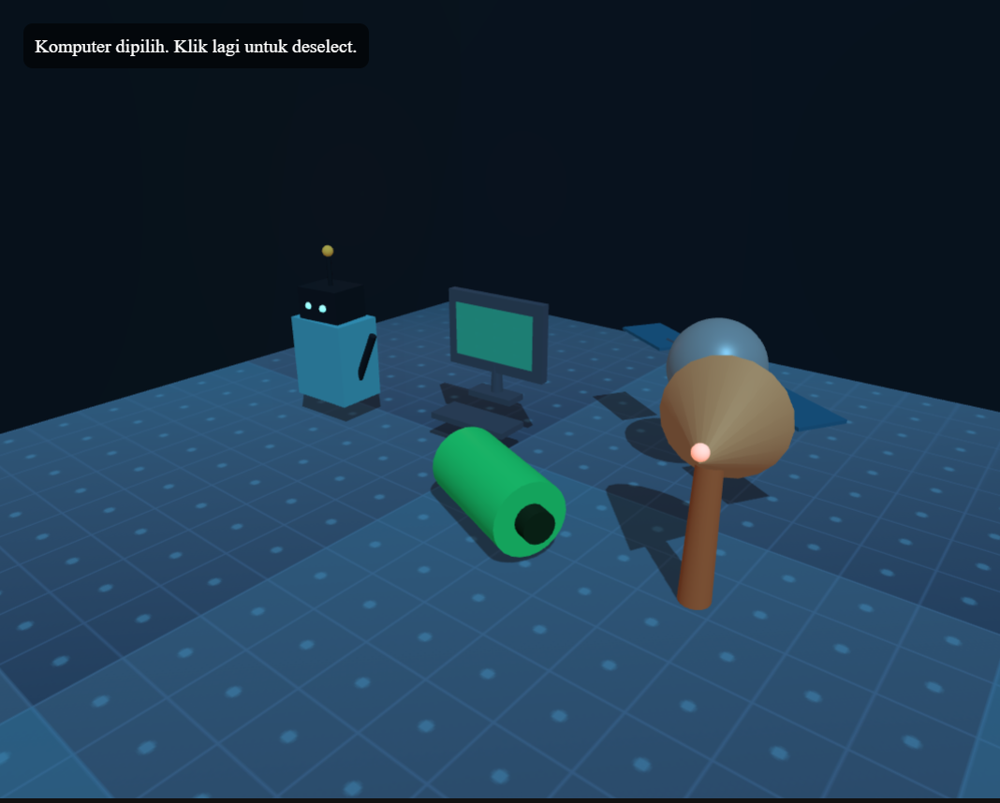

# Robot Research Lab

## Identitas

- Nama: M.Ihsan Rafli
- NIM: 2305010008

## Tema Scene

Scene Three.js bertema laboratorium robot dengan nuansa futuristik.

## Fitur Utama

- 5 objek 3D: robot, komputer, satelit, baterai, dan antena
- `TextureLoader` dengan tekstur lokal di `Textures/lab-grid.svg`
- 2 interaksi raycasting: hover dan klik pada objek
- Lighting dan shadow aktif
- OrbitControls untuk rotasi, zoom, dan pan kamera

## Cara Menjalankan

1. Buka proyek ini dengan VS Code.
2. Jalankan `index.html` menggunakan Live Server atau web server lokal.
3. Pastikan koneksi internet aktif karena Three.js di-load dari CDN `esm.sh`.
4. Klik robot atau komputer untuk melihat interaksi.

## Screenshot

## Catatan

- Jika file `screenshot.png` atau `screenshot-clicked.png` belum ada, tambahkan hasil screenshot scene ke root folder repo dengan nama tersebut.
